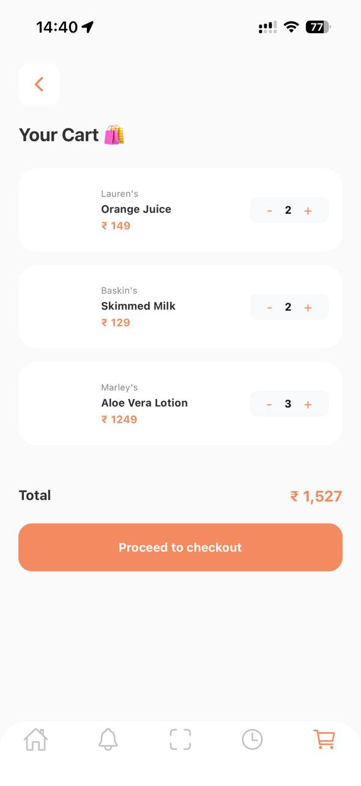
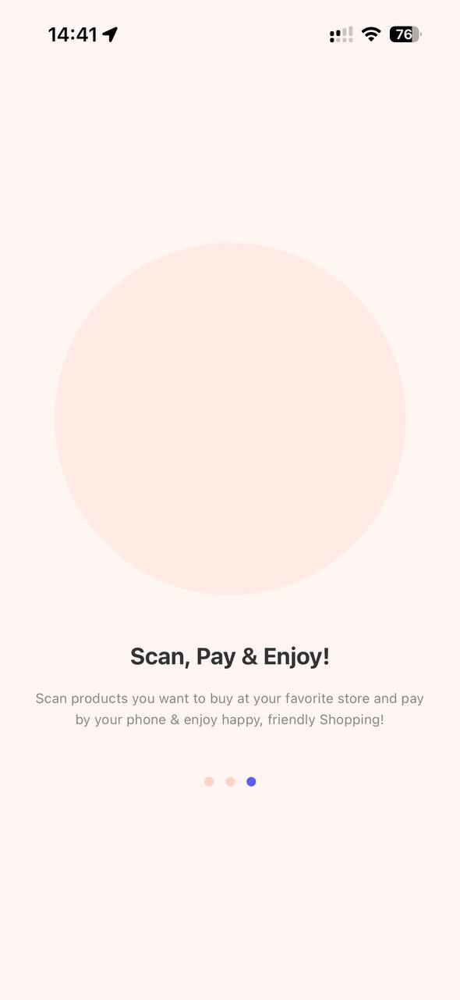
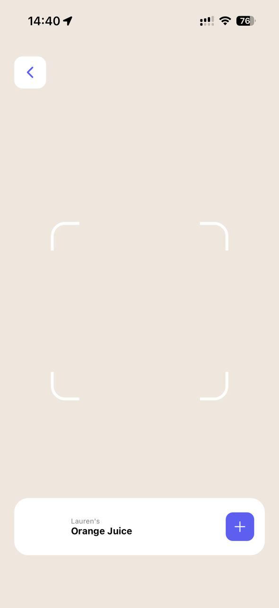
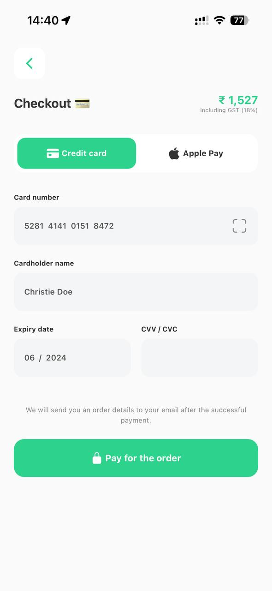
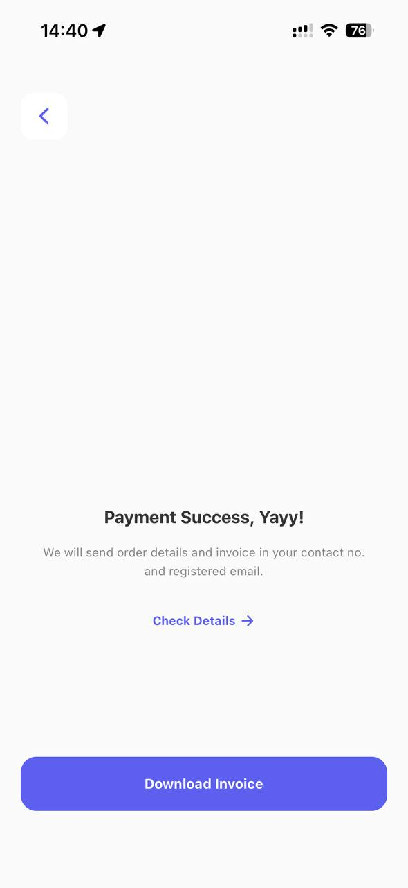
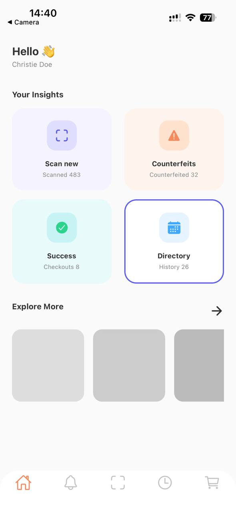
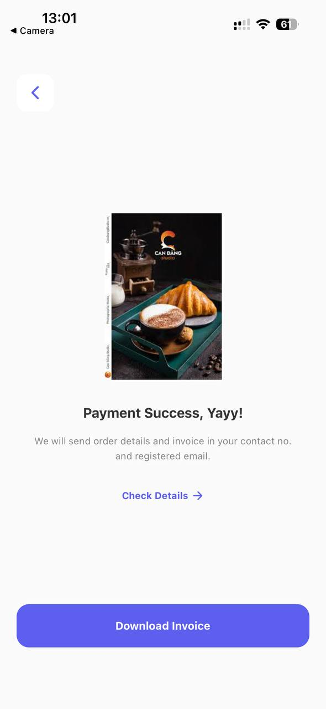
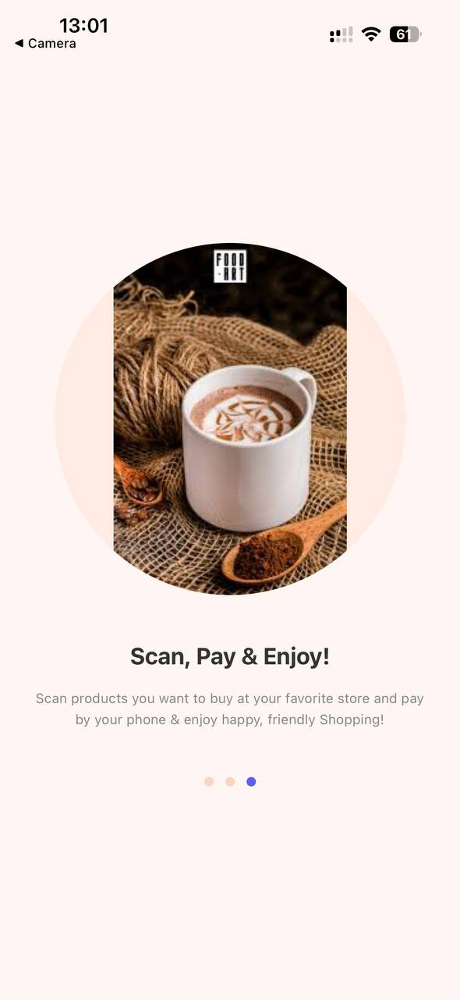
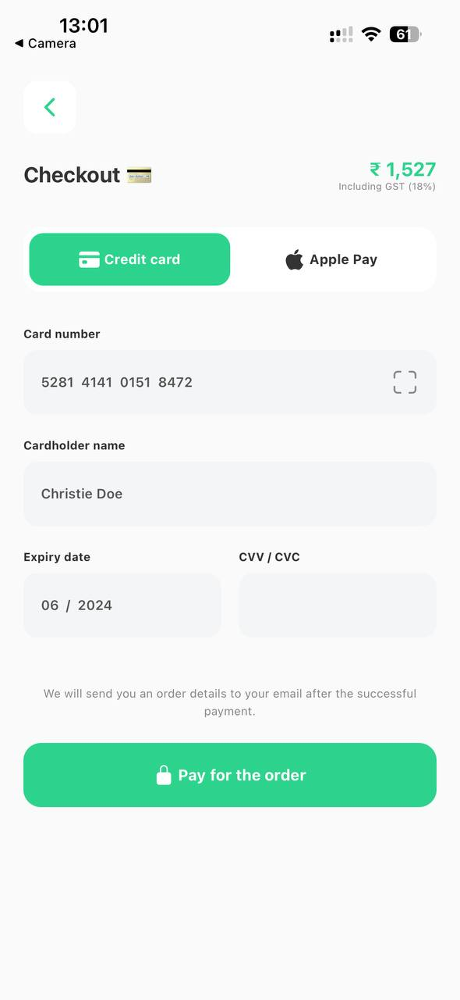
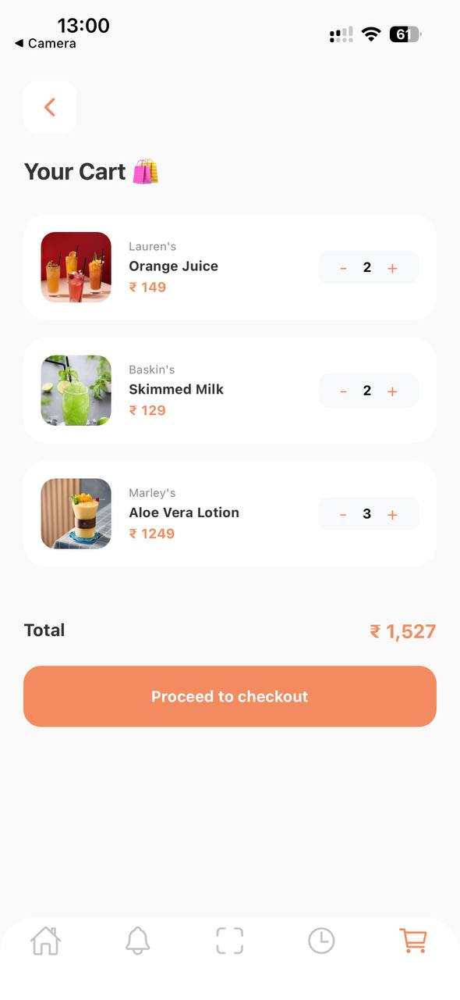

# Tổng hợp bài ảnh và code chạy các bài tập LT MOBILE
## Thông tin sinh viên
- Họ tên: Nguyễn Thế Hiệp
- MSSV: 23810310252
- Lớp: D18CNPM4

## Kết quả chạy

# Nhật ký thực hành React Native

| Bài tập | Ảnh 1 | Ảnh 2 | Ảnh 3 | Ảnh 4 | Ảnh 5 | Ảnh 6 | Video |
|--------|-------|-------|-------|-------|-------|-------|-------|
| Thực hành 16/03/2026 (N1): Bar-Code-Scan-App-Payment, Success |  |  |  |  |  |  |   |
| Thực hành 20/03/2026 (N1): Bar-Code-Scan-App - Home, Scan, Cart |  |  |  |  |  |  |   |